# PROJECT REPORT
**Submitted to**

**DEPARTMENT OF AI & DS**  
**GOBI ARTS & SCIENCE COLLEGE**  
**(AUTONOMOUS)**  
**GOBICHETTIPALAYAM – 638 453**

---

**By**

**KOWSAGAN S**  
**(23-AI-139)**

---

**Guided By**  
**Dr. M. Ramalingam, M.Sc.(CS)., M.C.A., Ph.D.**

---

*In partial fulfilment of the requirements for the award of the degree of*  
**Bachelor of Science (Computer Science, Artificial Intelligence & Data Science)**  
*in the faculty of Artificial Intelligence & Data Science in*  
**Gobi Arts & Science College (Autonomous), Gobichettipalayam**  
*affiliated to Bharathiyar University, Coimbatore.*

---

**MAY 2026**

---

&nbsp;

&nbsp;

&nbsp;

---

## DECLARATION

I hereby declare that the project report entitled **"RENTAL VEHICLE MANAGEMENT SYSTEM"** submitted to the Principal, Gobi Arts & Science College (Autonomous), Gobichettipalayam, in partial fulfilment of the requirements for the award of degree of Bachelor of Science (Computer Science, Artificial Intelligence & Data Science) is a record of project work done by me during the period of study in this college under the supervision and guidance of **Dr. M. Ramalingam, M.Sc.(CS)., M.C.A., Ph.D.**, Associate Professor, Department of Artificial Intelligence & Data Science.

| | |
|:---|:---|
| **Signature** | : |
| **Name** | : KOWSAGAN S |
| **Register Number** | : 23-AI-139 |
| **Date** | : |

---

&nbsp;

&nbsp;

---

## CERTIFICATE

This is to certify that the project report entitled **"RENTAL VEHICLE MANAGEMENT SYSTEM"** is a bonafide work done by **KOWSAGAN S (23AI139)** under my supervision and guidance.

| | |
|:---|:---|
| **Signature of Guide** | : |
| **Name** | : Dr. M. Ramalingam |
| **Designation** | : Associate Professor |
| **Department** | : Computer Science (AI & DS) |
| **Date** | : |

**Counter Signed**

| | |
|:---|:---|
| **Head of the Department** | **Principal** |

**Viva-Voce held on:** ___________

| | |
|:---|:---|
| **Internal Examiner** | **External Examiner** |

---

&nbsp;

&nbsp;

---

## ACKNOWLEDGEMENT

The completion of this project was not just because of my ability but there are some well-wishers behind it. I am always thankful to them.

I would like to express my deep sense of gratitude and obligation to the college council for providing necessary facilities and giving me the opportunity to undertake this project at **Gobi Arts & Science College (Autonomous), Gobichettipalayam**.

I wish to record my deep sense of gratitude to our beloved Principal **Dr. P. VENUGOPAL, M.Sc., M.Phil., PGDCA., Ph.D.**, and Vice Principal **Dr. M. RAJU, M.A., M.Phil., Ph.D.**, for their inspiration which made me complete this project.

I would like to acknowledge my gratitude to our beloved Head of the Department of Computer Science (Artificial Intelligence & Data Science) **Dr. M. Ramalingam, M.Sc.(CS)., M.C.A., Ph.D.**, for providing all facilities throughout the project work.

I express my sincere thanks and gratitude to my project guide **Dr. M. Ramalingam, M.Sc.(CS)., M.C.A., Ph.D.**, Associate Professor, Department of Computer Science (Artificial Intelligence & Data Science), Gobi Arts & Science College (Autonomous), Gobichettipalayam, who has given me overwhelming support and valuable guidance throughout the project period.

I am very much indebted to all faculty members of the Department of Artificial Intelligence & Data Science for their effort and inspiration to complete this project successfully.

Finally, I thank my friends, family, and parents for their moral support and encouragement to make this project a successful one.

**KOWSAGAN S**

---

&nbsp;

&nbsp;

---

## SYNOPSIS

The **Rental Vehicle Management System (RVMS)** is a production-ready, web-based platform developed to modernize and digitize the complete operational lifecycle of vehicle rental businesses. Traditional rental operations are plagued by manual booking processes, double-booking conflicts, inaccurate billing, and a lack of real-time fleet visibility. RVMS directly resolves these inefficiencies by integrating all business functions — from fleet inventory management to dynamic pricing, automated invoicing, and financial reporting — into a single, centralized application.

The system implements a strict **Role-Based Access Control (RBAC)** model with three primary access tiers:

- **Administrator** — Oversees the entire platform: fleet inventory, user management, financial data, system settings, and database backups.
- **Staff** — Manages day-to-day rental operations: booking approvals, customer management, payment records, and invoice generation.
- **Customer** — Browses the vehicle catalog, places bookings, tracks rental history, and manages account information.

Key functional highlights include multi-category fleet management, collision-aware booking validation, automated tax and discount calculation, professional invoice generation, and a comprehensive admin dashboard with revenue analytics. The backend is built on **PHP 8.2 with PDO** for secure MySQL database interactions, while the frontend leverages **HTML5, CSS3 (Vanilla CSS), and JavaScript (ES6+)** for a responsive, modern user interface.

This report documents the complete software engineering lifecycle of the project — from problem definition and system analysis through architecture design, database schema, module specification, implementation, testing, and future roadmap.

---

&nbsp;

&nbsp;

---

## TABLE OF CONTENTS

| S.No | Chapter | Title | Page No. |
| :--- | :--- | :--- | :--- |
| | | ACKNOWLEDGEMENT | i |
| | | SYNOPSIS | ii |
| **1** | | **INTRODUCTION** | **1** |
| 1.1 | | About the Project | |
| 1.2 | | Hardware Specification | |
| 1.3 | | Software Specification | |
| **2** | | **SYSTEM ANALYSIS** | |
| 2.1 | | Problem Definition | |
| 2.2 | | System Study | |
| 2.3 | | Proposed System | |
| **3** | | **SYSTEM DESIGN** | |
| 3.1 | | Data Flow Diagram | |
| 3.2 | | E–R Diagram | |
| 3.3 | | File Specification | |
| 3.4 | | Module Specification | |
| **4** | | **TESTING AND IMPLEMENTATION** | |
| **5** | | **CONCLUSION AND SUGGESTIONS** | |
| | | BIBLIOGRAPHY | |
| | | APPENDICES | |
| A | | Appendix – A (Screen Formats) | 21 |

---

&nbsp;

&nbsp;

---

## CHAPTER 1: INTRODUCTION

### INTRODUCTION

The **Rental Vehicle Management System (RVMS)** is a web-based rental management platform developed to modernize the complete operational workflow of vehicle rental businesses. In traditional markets, rental transactions are often handled manually through physical registers, handwritten receipts, and telephone-based bookings — leading to a lack of real-time visibility, frequent booking conflicts, inaccurate billing, and poor customer experience.

This project introduces a secure, role-based digital platform where administrators, staff, and customers seamlessly interact through a unified web interface. Built using **PHP, MySQL, Apache, HTML5, CSS3, and JavaScript**, the system ensures fleet transparency, booking accuracy, data integrity, and streamlined lifecycle management for every rental transaction. By digitizing the entire rental cycle — from vehicle onboarding to invoice generation — the platform enhances operational efficiency and provides a scalable solution for any vehicle rental enterprise.

---

### 1.1 About the Project

**Rental Vehicle Management System** is a full-stack web application designed to create a fair, efficient, and modern digital operations platform for vehicle rental businesses. The system replaces manual processes with an automated, real-time digital environment.

**Project Goals**

- Enable administrators to manage the entire fleet, control user access, and monitor financial performance from a centralized dashboard.
- Provide staff with tools for rapid booking approvals, customer check-ins, payment recording, and invoice generation.
- Give customers a self-service portal to browse vehicles, place bookings, track rental status, and manage account details.
- Ensure data integrity, billing accuracy, and transactional security at every layer of the system.

**Key Features**

| Feature | Description |
| :--- | :--- |
| Role-Based Access | Three distinct roles (Admin, Staff, Customer) with scoped permissions |
| Fleet Management | Multi-category vehicle inventory with image uploads and status management |
| Dynamic Booking Engine | Conflict-aware booking validation with automated pricing and tax calculation |
| Invoice Generation | Professional system-generated invoices for every completed booking |
| Payment Tracking | Records advance, partial, and full payments with method classification |
| Maintenance Logs | Vehicle service, repair, and damage records with cost tracking |
| Admin Dashboard | Real-time financial analytics, fleet health, and business performance KPIs |
| Customer Portal | Self-service booking history, active rental tracking, and account management |
| Responsive UI | Mobile-friendly interface using CSS Grid and Flexbox |

**Platform URL (Local)**  
`http://localhost/RentalVehicleSystem/`

---

### 1.2 Hardware Specification

| Component | Minimum Requirement | Recommended |
| :--- | :--- | :--- |
| Processor | Dual-core 2.0 GHz | Intel Core i5/i7 (3.0 GHz+) |
| RAM | 4 GB | 8 GB or higher |
| Storage | 20 GB HDD | 100 GB SSD |
| Network | 10 Mbps Ethernet | 100 Mbps Broadband |
| Display | 1024x768 resolution | 1920x1080 Full HD |
| Operating System | Windows 10 / Linux Ubuntu 20.04 | Windows 11 / Ubuntu 22.04 LTS |

---

### 1.3 Software Specification

| Layer | Technology | Version | Purpose |
| :--- | :--- | :--- | :--- |
| Web Server | Apache HTTP Server | 2.4+ | Request routing and static asset delivery |
| Backend Language | PHP | 8.2+ | Server-side business logic and API handling |
| Database | MySQL / MariaDB | 5.7+ / 10.4+ | Relational data persistence and ACID transactions |
| Frontend | HTML5 / CSS3 | Latest Standards | Responsive layout and component structure |
| Scripting | JavaScript (ES6+) | Vanilla | DOM interaction, form validation, dynamic UI |
| Local Dev Stack | XAMPP | 8.2.x | Bundled Apache + PHP + MySQL for local development |
| Browser Support | Chrome, Firefox, Edge | Latest | Target user-facing browsers |
| Version Control | Git | 2.x | Source code management |

---

&nbsp;

&nbsp;

---

## CHAPTER 2: SYSTEM ANALYSIS

### 2.1 Problem Definition

The traditional vehicle rental industry faces several critical operational challenges:

1. **Manual Booking Conflicts** — Without real-time availability tracking, vehicles are frequently double-booked, causing customer dissatisfaction and revenue loss.
2. **Inaccurate Billing** — Manual calculation of daily rates, taxes, and late fees leads to frequent billing errors and financial discrepancies.
3. **No Fleet Visibility** — Owners and staff have no real-time overview of which vehicles are available, rented, or in maintenance — making planning impossible.
4. **Paper-Based Documentation** — Physical storage of rental agreements, customer IDs, and payment records is insecure, difficult to search, and easily lost.
5. **No Financial Reporting** — Without automated reports, business owners cannot identify their most profitable vehicles, peak rental periods, or outstanding payments.
6. **Fragmented Customer Experience** — Customers must call or visit in person for every interaction, with no self-service option for bookings or account management.

**The Proposed Solution**

A structured, digital rental management platform that:

- Provides real-time vehicle status tracking across the entire fleet.
- Implements an intelligent booking engine that prevents conflicts and auto-calculates pricing.
- Automates invoice and payment documentation for every rental transaction.
- Maintains a complete digital audit trail for all users, bookings, payments, and maintenance records.

---

### 2.2 System Study

**Existing Systems Analysis**

| Existing Approach | Limitation |
| :--- | :--- |
| Physical Ledger / Register | No real-time tracking; prone to errors and conflicts |
| Telephone-Based Booking | Inefficient and limited to office hours; no digital record |
| Generic Spreadsheet Tools | Not designed for rental workflows; no billing automation |
| Third-Party Classified Ads | No booking or payment management; only basic listings |

**Stakeholder Analysis**

| Stakeholder | Role | Key Need |
| :--- | :--- | :--- |
| Admin | Platform Governor | Fleet control, user management, financial oversight |
| Staff | Operations Manager | Booking approvals, customer service, payment recording |
| Customer | Asset Renter | Vehicle browsing, easy booking, rental history |

**System Boundaries**

- **In Scope:** User authentication, fleet CRUD operations, booking engine, payment tracking, invoice generation, maintenance logs, admin reports, database backup.
- **Out of Scope:** GPS tracking integration, native mobile apps, third-party payment gateway.

---

### 2.3 Proposed System

The proposed system introduces a three-tier client-server architecture with the following components:

**Presentation Tier (Frontend)**  
HTML5, CSS3, and Vanilla JavaScript deliver responsive interfaces for all three user roles. Dynamic forms and real-time feedback are handled client-side without requiring full page reloads.

**Logic Tier (Backend)**  
PHP 8.2 handles all business logic including authentication, role-based authorization, booking conflict detection, dynamic pricing, invoice generation, and maintenance management via PDO-based secure database interactions.

**Data Tier (Database)**  
MySQL stores all relational data including users, vehicles, categories, customers, bookings, payments, invoices, maintenance logs, and settings — enforced with referential integrity through foreign keys.

**Advantages Over Existing Approaches**

- ✅ Real-time fleet availability and status management
- ✅ Automated collision-aware booking validation
- ✅ Dynamic pricing with configurable tax and discount rules
- ✅ Professional invoice generation and payment recording
- ✅ Complete audit trail and analytics reporting
- ✅ Role-controlled access for Admin, Staff, and Customer

---

&nbsp;

&nbsp;

---

## CHAPTER 3: SYSTEM DESIGN

### 3.1 Data Flow Diagram

**DFD Level 0 — Context Diagram**

Shows the three external entities — **Admin**, **Staff**, and **Customer** — interacting with the RVMS as a single unified system. Each entity sends inputs (login credentials, booking requests, vehicle data) and receives outputs (dashboards, invoices, receipts).

**DFD Level 1 — Major Processes**

- **Process 1.0 Authentication:** Accepts credentials from all three user types, validates against the `users` table, and redirects to role-specific dashboards.
- **Process 2.0 Fleet Management:** Admin/Staff manage vehicle CRUD operations and category assignments; updates are reflected in the `vehicles` and `categories` tables.
- **Process 3.0 Booking Engine:** Accepts booking requests, validates date conflict against the `bookings` table, calculates costs, and stores the confirmed booking.
- **Process 4.0 Financial Processing:** Records payments against bookings, generates invoice records, and feeds data to the reporting aggregator.
- **Process 5.0 Maintenance Logging:** Tracks vehicle service events and costs in the `maintenance` table; updates vehicle status as needed.

**DFD Level 2 — Booking Sub-process**

Zooms into Process 3.0: Customer selects vehicle → System checks availability window → Calculates subtotal, discount, and tax → Creates booking record → Updates vehicle status → Generates invoice.

---

### 3.2 E–R Diagram

The Entity-Relationship model defines the following primary entities and relationships:

- **USERS** *(user_id, username, email, role, status)* — One user can have one associated Customer record.
- **CUSTOMERS** *(customer_id, user_id, full_name, license_number, phone)* — A customer can have many Bookings.
- **VEHICLES** *(vehicle_id, category_id, vehicle_name, daily_rate, status)* — A vehicle belongs to one Category and can appear in many Bookings.
- **CATEGORIES** *(category_id, name, description)* — One category can contain many Vehicles.
- **BOOKINGS** *(booking_id, customer_id, vehicle_id, start_date, end_date, total_amount, status)* — A booking links one Customer to one Vehicle and can have one Invoice and many Payments.
- **PAYMENTS** *(payment_id, booking_id, amount, method, status)* — Many payments can be associated to one Booking.
- **INVOICES** *(invoice_id, booking_id, customer_id, invoice_number, total_amount, status)* — One invoice is generated per completed Booking.
- **MAINTENANCE** *(maintenance_id, vehicle_id, type, cost, date, status)* — Many maintenance records can be linked to one Vehicle.
- **SETTINGS** *(setting_key, setting_value)* — Stores global configuration key-value pairs.

---

### 3.3 File Specification

**Root-Level Files**

| File | Type | Purpose |
| :--- | :--- | :--- |
| `index.php` | PHP | Login portal and system entry point |
| `dashboard.php` | PHP | Role-based dashboard router (Admin, Staff, Customer) |
| `logout.php` | PHP | Session destruction and redirect to login |
| `404.php` | PHP | Custom error page for undefined routes |
| `.htaccess` | Config | URL rewriting and security headers |

**/config/ — Configuration & Core Library**

| File | Purpose |
| :--- | :--- |
| `config.php` | System constants: BASE_URL, paths, pagination, roles, status enums |
| `database.php` | PDO connection factory (`Database` class and `getDB()` global helper) |
| `auth.php` | Session management: `requireLogin()`, `requireRole()`, `loginUser()`, `logoutUser()` |
| `functions.php` | Utility helpers: `sanitize()`, `formatCurrency()`, `calculateRentalCost()`, `uploadFile()`, `getSetting()` |

**/includes/ — Shared UI Components**

| File | Purpose |
| :--- | :--- |
| `header.php` | Common HTML head, navigation sidebar, and user session badge |
| `footer.php` | Common HTML footer and closing script tags |

**/pages/ — Core Application Pages**

| File | Role Access | Purpose |
| :--- | :--- | :--- |
| `vehicles.php` | Admin, Staff | Fleet CRUD: list, add, edit, delete vehicles with image upload |
| `vehicle-details.php` | Admin, Staff | Detailed view of a single vehicle with booking history |
| `categories.php` | Admin, Staff | Vehicle category management (Car, Bike, Van, Lorry, Bus) |
| `bookings.php` | Admin, Staff | Booking management: create, approve, complete, cancel rentals |
| `booking-details.php` | Admin, Staff | Detailed view of a single booking with payment and invoice links |
| `customers.php` | Admin, Staff | Customer CRM: list, add, edit customer profiles and license data |
| `payments.php` | Admin, Staff | Record and view payment transactions for bookings |
| `invoices.php` | Admin, Staff | Invoice listing with status tracking |
| `invoice-view.php` | Admin, Staff, Customer | Printable invoice detail view for a single booking |
| `maintenance.php` | Admin, Staff | Fleet maintenance log: service, repair, damage tracking |
| `reports.php` | Admin | Revenue analytics, fleet statistics, booking summaries |
| `settings.php` | Admin, Customer | System settings (Admin) / Account settings (Customer) |
| `users.php` | Admin | User account management: roles, status, creation |
| `backup.php` | Admin | Database export/backup utility |
| `my-bookings.php` | Customer | Customer's personal booking history and status tracking |

**/db/ — Database Schema**

| File | Purpose |
| :--- | :--- |
| `rvms_database.sql` | Complete DDL: CREATE TABLE statements, indexes, sample data, and dashboard view |

**/uploads/ — File Storage**

| Directory | Purpose |
| :--- | :--- |
| `uploads/vehicles/` | Vehicle image files uploaded during fleet management |

**/assets/ — Static Resources**

| Directory | Purpose |
| :--- | :--- |
| `assets/css/` | Stylesheets for the application UI |
| `assets/js/` | Client-side JavaScript for form validation and dynamic behavior |
| `assets/images/` | System icons and default placeholder images |
| `assets/screenshots/` | Application interface screenshots for documentation |

---

### 3.4 Database Table Specifications

This section provides the complete physical data model of the application, documenting the structure, constraints, and purpose of every table in the MySQL database `rvms_db`.

**1. Table: `users`**

Purpose: Stores profile and authentication credentials for all platform participants (Admin, Staff, Customer).

| Column | Type | Null | Key | Default | Description |
| :--- | :--- | :--- | :--- | :--- | :--- |
| `id` | INT | NO | PRI | NULL | Auto-incrementing unique user ID |
| `username` | VARCHAR(50) | NO | UNI | NULL | Unique login name |
| `email` | VARCHAR(100) | NO | UNI | NULL | User's primary email address |
| `password` | VARCHAR(255) | NO | | NULL | Bcrypt hashed password |
| `full_name` | VARCHAR(100) | NO | | NULL | Complete name of the user |
| `role` | ENUM | NO | | 'customer' | Access level: admin, staff, customer |
| `phone` | VARCHAR(20) | YES | | NULL | Contact telephone number |
| `address` | TEXT | YES | | NULL | Physical address |
| `status` | ENUM | YES | | 'active' | Account state: active, inactive |
| `created_at` | TIMESTAMP | YES | | CURRENT_TIMESTAMP | Registration timestamp |
| `updated_at` | TIMESTAMP | YES | | ON UPDATE | Last modification timestamp |

**2. Table: `categories`**

Purpose: Defines the vehicle classification segments available on the platform.

| Column | Type | Null | Key | Default | Description |
| :--- | :--- | :--- | :--- | :--- | :--- |
| `id` | INT | NO | PRI | NULL | Auto-incrementing category ID |
| `name` | VARCHAR(50) | NO | UNI | NULL | Category name (e.g., Car, Bike, Van) |
| `description` | TEXT | YES | | NULL | Features and description of the category |
| `icon` | VARCHAR(50) | YES | | NULL | UI icon identifier (e.g., 'car') |
| `status` | ENUM | YES | | 'active' | Category visibility: active, inactive |
| `created_at` | TIMESTAMP | YES | | CURRENT_TIMESTAMP | Date of creation |

**3. Table: `vehicles`**

Purpose: Manages the complete inventory of rental fleet assets.

| Column | Type | Null | Key | Default | Description |
| :--- | :--- | :--- | :--- | :--- | :--- |
| `id` | INT | NO | PRI | NULL | Auto-incrementing vehicle ID |
| `category_id` | INT | NO | MUL | NULL | Link to categories.id |
| `vehicle_name` | VARCHAR(100) | NO | | NULL | Commercial model name |
| `brand` | VARCHAR(50) | YES | | NULL | Manufacturer name |
| `model` | VARCHAR(50) | YES | | NULL | Specific model variant |
| `year` | INT | YES | | NULL | Manufacturing year |
| `color` | VARCHAR(30) | YES | | NULL | Vehicle color |
| `registration_number` | VARCHAR(50) | NO | UNI | NULL | Unique government registration plate |
| `chassis_number` | VARCHAR(100) | YES | | NULL | Chassis identification number |
| `engine_number` | VARCHAR(100) | YES | | NULL | Engine identification number |
| `fuel_type` | ENUM | YES | | 'petrol' | Fuel category: petrol, diesel, electric, hybrid |
| `seating_capacity` | INT | YES | | 4 | Number of passengers |
| `daily_rate` | DECIMAL(10,2) | NO | | NULL | Base rental cost per day |
| `weekly_rate` | DECIMAL(10,2) | YES | | NULL | Rental cost for 7-day period |
| `monthly_rate` | DECIMAL(10,2) | YES | | NULL | Rental cost for 30-day period |
| `image` | VARCHAR(255) | YES | | NULL | Path to the vehicle's uploaded image |
| `description` | TEXT | YES | | NULL | Asset details and features |
| `status` | ENUM | YES | | 'available' | Fleet status: available, rented, maintenance, inactive |
| `mileage` | INT | YES | | 0 | Current recorded mileage |
| `created_at` | TIMESTAMP | YES | | CURRENT_TIMESTAMP | Date of fleet entry |
| `updated_at` | TIMESTAMP | YES | | ON UPDATE | Last update timestamp |

**4. Table: `customers`**

Purpose: Extends user profiles with rental-specific KYC and license information for booking-eligible customers.

| Column | Type | Null | Key | Default | Description |
| :--- | :--- | :--- | :--- | :--- | :--- |
| `id` | INT | NO | PRI | NULL | Auto-incrementing customer ID |
| `user_id` | INT | YES | MUL | NULL | Link to users.id (nullable for walk-in customers) |
| `customer_code` | VARCHAR(20) | NO | UNI | NULL | System-generated unique reference code |
| `full_name` | VARCHAR(100) | NO | | NULL | Customer's legal name |
| `email` | VARCHAR(100) | YES | | NULL | Contact email |
| `phone` | VARCHAR(20) | NO | | NULL | Primary contact number |
| `address` | TEXT | YES | | NULL | Residential address |
| `license_number` | VARCHAR(50) | YES | | NULL | Driver's license number |
| `license_expiry` | DATE | YES | | NULL | Expiry date of the license |
| `id_proof` | VARCHAR(255) | YES | | NULL | Path to uploaded ID document |
| `address_proof` | VARCHAR(255) | YES | | NULL | Path to uploaded address document |
| `status` | ENUM | YES | | 'active' | Status: active, inactive, blacklisted |
| `created_at` | TIMESTAMP | YES | | CURRENT_TIMESTAMP | Date of customer profile creation |

**5. Table: `bookings`**

Purpose: The core transactional engine — records every rental reservation and its complete financial summary.

| Column | Type | Null | Key | Default | Description |
| :--- | :--- | :--- | :--- | :--- | :--- |
| `id` | INT | NO | PRI | NULL | Auto-incrementing booking ID |
| `booking_number` | VARCHAR(20) | NO | UNI | NULL | User-facing booking reference (e.g., BK-A1B2C3) |
| `customer_id` | INT | NO | MUL | NULL | Link to customers.id |
| `vehicle_id` | INT | NO | MUL | NULL | Link to vehicles.id |
| `start_date` | DATE | NO | | NULL | Rental commencement date |
| `end_date` | DATE | NO | | NULL | Scheduled vehicle return date |
| `pickup_location` | VARCHAR(255) | YES | | NULL | Vehicle pickup address |
| `dropoff_location` | VARCHAR(255) | YES | | NULL | Vehicle return address |
| `daily_rate` | DECIMAL(10,2) | NO | | NULL | Rate locked at time of booking |
| `total_days` | INT | NO | | NULL | Total rental duration in days |
| `subtotal` | DECIMAL(10,2) | NO | | NULL | Pre-tax, pre-discount cost |
| `discount` | DECIMAL(10,2) | YES | | 0 | Discount amount applied |
| `tax` | DECIMAL(10,2) | YES | | 0 | Tax amount applied |
| `total_amount` | DECIMAL(10,2) | NO | | NULL | Final billable amount |
| `advance_payment` | DECIMAL(10,2) | YES | | 0 | Upfront deposit collected |
| `status` | ENUM | YES | | 'pending' | Lifecycle: pending, approved, active, completed, cancelled, rejected |
| `notes` | TEXT | YES | | NULL | Internal staff notes |
| `approved_by` | INT | YES | | NULL | ID of staff who approved |
| `approved_at` | TIMESTAMP | YES | | NULL | Approval timestamp |
| `created_at` | TIMESTAMP | YES | | CURRENT_TIMESTAMP | Booking creation timestamp |

**6. Table: `payments`**

Purpose: Records all financial inflows associated with bookings.

| Column | Type | Null | Key | Default | Description |
| :--- | :--- | :--- | :--- | :--- | :--- |
| `id` | INT | NO | PRI | NULL | Auto-incrementing payment ID |
| `booking_id` | INT | NO | MUL | NULL | Link to bookings.id |
| `payment_number` | VARCHAR(20) | NO | UNI | NULL | Unique payment reference number |
| `payment_type` | ENUM | YES | | 'full' | Transaction type: advance, full, partial, refund |
| `amount` | DECIMAL(10,2) | NO | | NULL | Amount paid |
| `payment_method` | ENUM | YES | | 'cash' | Payment channel: cash, card, bank_transfer, online |
| `payment_date` | TIMESTAMP | YES | | CURRENT_TIMESTAMP | Date and time of the transaction |
| `status` | ENUM | YES | | 'pending' | Status: pending, completed, failed, refunded |
| `transaction_id` | VARCHAR(100) | YES | | NULL | External transaction reference |
| `notes` | TEXT | YES | | NULL | Staff notes on the payment |
| `created_by` | INT | YES | | NULL | ID of staff who recorded the payment |

**7. Table: `invoices`**

Purpose: Formal financial documents generated by the system for every completed or paid booking.

| Column | Type | Null | Key | Default | Description |
| :--- | :--- | :--- | :--- | :--- | :--- |
| `id` | INT | NO | PRI | NULL | Auto-incrementing invoice ID |
| `invoice_number` | VARCHAR(20) | NO | UNI | NULL | Formatted number (e.g., INV-00001) |
| `booking_id` | INT | NO | MUL | NULL | Link to bookings.id |
| `customer_id` | INT | NO | MUL | NULL | Link to customers.id |
| `issue_date` | DATE | NO | | NULL | Invoice generation date |
| `due_date` | DATE | YES | | NULL | Payment due date |
| `subtotal` | DECIMAL(10,2) | NO | | NULL | Amount before tax and discount |
| `tax` | DECIMAL(10,2) | YES | | 0 | Tax applied |
| `discount` | DECIMAL(10,2) | YES | | 0 | Discount applied |
| `total_amount` | DECIMAL(10,2) | NO | | NULL | Final invoice total |
| `paid_amount` | DECIMAL(10,2) | YES | | 0 | Amount already received |
| `status` | ENUM | YES | | 'draft' | Status: draft, sent, paid, overdue, cancelled |
| `notes` | TEXT | YES | | NULL | Additional invoice remarks |
| `created_at` | TIMESTAMP | YES | | CURRENT_TIMESTAMP | Invoice creation timestamp |

**8. Table: `maintenance`**

Purpose: Logs all vehicle health events including scheduled services, repairs, and damage assessments.

| Column | Type | Null | Key | Default | Description |
| :--- | :--- | :--- | :--- | :--- | :--- |
| `id` | INT | NO | PRI | NULL | Auto-incrementing log ID |
| `vehicle_id` | INT | NO | MUL | NULL | Link to vehicles.id |
| `booking_id` | INT | YES | MUL | NULL | Link to bookings.id (for damage cases) |
| `maintenance_type` | ENUM | YES | | 'service' | Type: service, repair, damage, inspection, other |
| `title` | VARCHAR(255) | NO | | NULL | Short title of the maintenance event |
| `description` | TEXT | YES | | NULL | Detailed description of the work |
| `cost` | DECIMAL(10,2) | YES | | 0 | Financial expense for the event |
| `maintenance_date` | DATE | NO | | NULL | Date of the maintenance event |
| `completed_date` | DATE | YES | | NULL | Date work was completed |
| `status` | ENUM | YES | | 'pending' | Status: pending, in_progress, completed, cancelled |
| `service_provider` | VARCHAR(100) | YES | | NULL | Name of the workshop or mechanic |
| `next_service_date` | DATE | YES | | NULL | Scheduled next service date |
| `mileage_at_service` | INT | YES | | NULL | Vehicle mileage during the service |
| `created_by` | INT | YES | | NULL | ID of staff who logged the event |
| `created_at` | TIMESTAMP | YES | | CURRENT_TIMESTAMP | Log creation timestamp |

**9. Table: `settings`**

Purpose: Stores all global system configuration parameters as key-value pairs.

| Column | Type | Null | Key | Default | Description |
| :--- | :--- | :--- | :--- | :--- | :--- |
| `id` | INT | NO | PRI | NULL | Auto-incrementing setting ID |
| `setting_key` | VARCHAR(100) | NO | UNI | NULL | Config identifier (e.g., 'tax_rate', 'company_name') |
| `setting_value` | TEXT | YES | | NULL | The stored value for the key |
| `setting_type` | VARCHAR(50) | YES | | 'text' | Data type hint: text, number, email |
| `description` | TEXT | YES | | NULL | Human-readable description of the setting |
| `updated_at` | TIMESTAMP | YES | | ON UPDATE | Last modification timestamp |

**Database View: `dashboard_stats`**

Purpose: A pre-computed SQL view used to efficiently power the admin dashboard stat-cards without complex repeated queries.

| Field | Source | Description |
| :--- | :--- | :--- |
| `available_vehicles` | vehicles | COUNT of vehicles with status = 'available' |
| `rented_vehicles` | vehicles | COUNT of vehicles with status = 'rented' |
| `active_bookings` | bookings | COUNT of pending, approved, and active bookings |
| `active_customers` | customers | COUNT of customers with status = 'active' |
| `today_revenue` | bookings | SUM of total_amount for bookings created today |
| `month_revenue` | bookings | SUM of total_amount for bookings in current month |

---

### 3.4 Module Specification

**Module 1: Authentication & Authorization**

Purpose: Secure user identity verification and session lifecycle management.

Functions:
- `loginUser($username, $password)` — Accepts POST credentials, queries `users` table, verifies bcrypt hash (`password_verify()`), sets session variables (`user_id`, `user_role`, `user_name`), and returns a status result.
- `requireLogin()` — Guards all protected pages; redirects unauthenticated users to `index.php`.
- `requireRole($roles)` — Grants access only to specified role(s); unauthorized users are redirected to `dashboard.php`.
- `logoutUser()` — Destroys all session data, clears session cookie, redirects to login.

Security Measures:
- `password_hash()` with `PASSWORD_DEFAULT` (bcrypt) on registration.
- `password_verify()` on login.
- All inputs passed through `htmlspecialchars()` and PDO prepared statements.
- Session cookie management prevents fixation attacks.

---

**Module 2: Fleet Inventory Management**

Purpose: Complete lifecycle management of all vehicles in the rental fleet.

Key Operations:
- **Create:** Add new vehicle with category, brand, model, specs, image upload, and rental rates.
- **Read:** Searchable, filterable list with status badges and pagination.
- **Update:** Modify all vehicle details including real-time status changes (Available ↔ Rented ↔ Maintenance).
- **Delete:** Remove a vehicle (with associated image cleanup).

Vehicle Status Lifecycle:

```
[Available] → [Rented] → [Available]
      ↓                       ↓
[Maintenance] ←————————— [Rented]
```

---

**Module 3: Dynamic Booking Engine**

Purpose: Accept, validate, conflict-check, and price rental booking requests.

Validation Rules:
1. The requested vehicle must have status = 'available'.
2. The requested date range must not overlap with any existing 'approved' or 'active' bookings for the same vehicle.
3. The start date must be today or in the future.
4. All mandatory fields (customer, vehicle, dates) must be supplied.

Booking Price Calculation (via `calculateRentalCost()`):
```
Subtotal     = daily_rate × total_days
Discount     = (subtotal × discount%) / 100
After Disc.  = subtotal - discount
Tax          = (after_discount × tax_rate%) / 100
Total Amount = after_discount + tax
```

Booking Process Flow:
1. Staff selects customer and vehicle, enters dates.
2. System calls `checkVehicleAvailability()` to detect conflicts.
3. Dynamic cost preview is calculated and displayed.
4. Booking is created with status = 'pending'.
5. Staff approves → status changes to 'approved', vehicle status → 'rented'.
6. On return → booking status → 'completed', vehicle status → 'available'.

---

**Module 4: Customer CRM Module**

Purpose: Manage comprehensive customer profiles and rental eligibility data.

Key Features:
- Create and manage customer records independent of system user accounts (supports walk-in customers).
- Store driver's license number, expiry date, and identity document uploads.
- Automatic unique `customer_code` generation (CUST-XXXXXXXX prefix format).
- Quick-search by name, phone, or email for rapid staff lookup during check-ins.
- Customer status management: Active, Inactive, Blacklisted.

---

**Module 5: Financial & Payment Processing**

Purpose: Record all monetary transactions and maintain the financial integrity of the platform.

Sub-Modules:

| Sub-Module | Page | Capability |
| :--- | :--- | :--- |
| Payment Recording | payments.php | Log advance, partial, and full payments per booking |
| Invoice Generation | invoices.php | Auto-generate system-stamped professional invoices |
| Invoice View | invoice-view.php | Printable detail view for customer and staff |

Payment Recording includes:
- Unique payment number generation (`PAY-XXXXXXXX` prefix).
- Payment method classification: Cash, Card, Bank Transfer, Online.
- Status tracking: Pending → Completed → Refunded.

---

**Module 6: Fleet Maintenance & Health Logs**

Purpose: Track all vehicle service events, repair costs, and damage assessments.

Key Features:
- Log maintenance events with type (Service, Repair, Damage, Inspection), dates, and service provider.
- Track financial outlay per event for cost-of-ownership analysis.
- Link damage events to the specific booking responsible.
- Record `mileage_at_service` and `next_service_date` for proactive fleet health management.
- Status tracking: Pending → In Progress → Completed → Cancelled.

---

**Module 7: Admin Analytics & Reporting Dashboard**

Purpose: Provide administrators with data-driven oversight of the entire rental operation.

Sub-Modules:

| Sub-Module | File | Capability |
| :--- | :--- | :--- |
| Dashboard Overview | dashboard.php | KPI stat-cards: available vehicles, active bookings, today/month revenue |
| User Management | users.php | Full user directory with role and status management |
| Fleet Reports | reports.php | Revenue trends, fleet utilization, booking summaries |
| System Settings | settings.php | Company info, tax rates, currency, invoice prefix configuration |
| Database Backup | backup.php | On-demand SQL database export and download |

---

&nbsp;

&nbsp;

---

## CHAPTER 4: TESTING AND IMPLEMENTATION

### 4.1 System Testing

#### 4.1.1 Unit Testing

Unit testing focused on validating individual functions and components in isolation.

- **`sanitize()` Helper:** Verified that user inputs containing HTML tags and special characters are correctly stripped and encoded.
- **`calculateRentalCost()` Function:** Tested with multiple rate/day/discount/tax combinations to confirm arithmetic accuracy.
- **`checkVehicleAvailability()` Function:** Validated correct detection of overlapping date ranges across three conflict scenarios (overlap at start, overlap at end, full overlap).
- **`generateUniqueCode()` Function:** Verified uniqueness algorithm correctly avoids generating duplicate booking and payment numbers.

#### 4.1.2 Integration Testing

Integration testing checked the interaction between the PHP backend, the PDO database layer, and the frontend forms.

- **Login Workflow:** Verified that successful login correctly initializes all seven session variables (`user_id`, `username`, `user_email`, `user_name`, `user_role`) and triggers the correct role-based redirect.
- **Vehicle Booking Submission:** Ensured that form data flows correctly through sanitization, availability check, cost calculation, database insert, and confirmation redirect.
- **Image Upload Pipeline:** Confirmed that uploaded vehicle images are correctly moved to `uploads/vehicles/`, with the filename stored in the `vehicles.image` column.

#### 4.1.3 Validation Testing

- **Booking Conflict Detection:** Verified that an attempt to book a vehicle on an already-reserved date correctly returns an error message and blocks the insert.
- **Form Validation:** Confirmed that all required fields trigger browser-level HTML5 validation before server-side processing.
- **Role Access Control:** Verified that accessing `/pages/users.php` while logged in as a Customer role correctly redirects to the dashboard with an "unauthorized" message.

#### 4.1.4 Output Testing

- **Error Messages:** Verified that database failures and validation errors produce descriptive flash messages via `setFlashMessage()`.
- **Invoice Generation:** Confirmed that `invoice_number` values are generated correctly with the `INV-` prefix.
- **Currency Formatting:** Verified `formatCurrency()` outputs correctly localized values with the configured currency symbol.

---

### 4.2 Implementation Tools & Environment

#### 4.2.1 Development Environment

- **Stack:** XAMPP 8.2 (Apache 2.4, PHP 8.2.12, MariaDB 10.4)
- **Editor:** Visual Studio Code with PHP IntelliSense support
- **Version Control:** Git 2.x with local repository

#### 4.2.2 Database Setup

- Execute `db/rvms_database.sql` via phpMyAdmin or MySQL CLI.
- File includes: `CREATE DATABASE`, all `CREATE TABLE` statements, indexes, foreign keys, default admin user (`admin / password`), sample categories, and vehicles.
- Dashboard view `dashboard_stats` is automatically created by the SQL script.

---

### 4.3 System Security Policies

#### 4.3.1 Authentication & Authorization

- **Bcrypt Hashing:** All passwords hashed via `password_hash()` with `PASSWORD_DEFAULT` (cost factor: 10).
- **Role Enforcement:** Every protected page begins with `requireRole(['admin'])`, `requireRole(['admin','staff'])`, or `requireLogin()` to prevent unauthorized access.
- **Session Security:** Sessions are properly destroyed on logout via `session_destroy()` and cookie expiration.

#### 4.3.2 Input Validation & Sanitization

- **PDO Prepared Statements:** Every database query uses parameterized queries, preventing SQL Injection attacks entirely.
- **Output Encoding:** All user-generated content is escaped with `htmlspecialchars()` before rendering in HTML, preventing XSS attacks.
- **File Upload Validation:** Uploaded images are validated by MIME type (`finfo`) and capped at 5MB (`MAX_FILE_SIZE`).

---

### 4.4 Unit & Integration Testing Summary

Testing was conducted across all critical workflows covering the three user roles. The testing process achieved a **100% pass rate** on all critical path operations. Minor issues related to image preview rendering were identified and resolved during the integration phase.

| Test Area | Status | Notes |
| :--- | :--- | :--- |
| Login / Logout | Passed | All roles correctly authenticated and redirected |
| Booking Conflict Detection | Passed | Overlapping bookings correctly blocked |
| Cost Calculation | Passed | Accurate across all tax and discount combinations |
| Invoice Generation | Passed | Unique numbers generated consistently |
| Role Access Control | Passed | Unauthorized role access blocked at every page |
| Image Upload | Passed | Files correctly stored and linked after initial path fix |

---

### 4.5 User Acceptance Testing (UAT)

#### 4.5.1 UAT Participants

The system was tested by representative users from each target persona: a business administrator, a rental staff member, and a customer.

#### 4.5.2 UAT Scenarios Tested

1. **Admin:** Created a new vehicle category, added a vehicle, managed user accounts, reviewed financial reports.
2. **Staff:** Created a new customer profile, placed a booking, recorded a payment, generated and viewed the invoice.
3. **Customer:** Viewed personal booking history and updated account settings.

#### 4.5.3 UAT Feedback & Improvements

- **Improvement:** Added color-coded status badges (Available: Green, Rented: Yellow, Maintenance: Red) to the vehicle list table based on staff feedback for quicker fleet status scanning.
- **Improvement:** Added a paginated transaction history on the Customer dashboard based on customer feedback for managing long booking records.

---

&nbsp;

&nbsp;

---

## CHAPTER 5: CONCLUSION AND SUGGESTIONS

### 5.1 Conclusion

The development of the **Rental Vehicle Management System (RVMS)** has successfully demonstrated how a well-designed web-based platform can transform the operational efficiency of a traditional service industry. By providing a unified, role-based digital environment for administrators, staff, and customers, the system achieves its core objectives of eliminating booking conflicts, automating financial calculations, and delivering real-time fleet visibility.

Key achievements of the project include:

- **Operational Efficiency:** Automated booking workflows reduce processing time from minutes to seconds, eliminating manual double-booking conflicts entirely.
- **Financial Accuracy:** The dynamic pricing engine with configurable tax rates and discounts ensures every invoice is calculated with mathematical precision.
- **Data Security:** Role-Based Access Control, bcrypt password hashing, and PDO Prepared Statements collectively protect all user and financial data.
- **Scalable Architecture:** The three-tier, modular PHP architecture provides a solid foundation for future feature additions without requiring core rewrites.
- **Stakeholder Satisfaction:** The self-service customer portal significantly reduces staff workload for routine inquiries while improving the customer experience.

In conclusion, RVMS demonstrates the transformative power of web-based solutions in modernizing traditional service businesses, providing a professional and efficient digital backbone for any vehicle rental enterprise — from small independent agencies to multi-branch operations.

---

### 5.2 Suggestions for Future Enhancement

While the current system provides a comprehensive operational baseline, the following enhancements are recommended for future development to increase competitiveness and user experience:

1. **Payment Gateway Integration**  
   Integration of secure payment gateways (e.g., Razorpay, Stripe, PayPal) to enable online advance payment collection and automated security deposit management.

2. **Mobile Native Applications**  
   Development of native Android and iOS applications to provide customers with push notifications for booking approvals and real-time vehicle availability browsing on mobile devices.

3. **GPS & Telematics Integration**  
   Embedding GPS tracking capabilities to monitor real-time vehicle location, estimated return time, and engine diagnostic data for the administrator's fleet overview.

4. **Automated SMS & Email Notifications**  
   Implementing an external messaging service (e.g., Twilio, SendGrid) to send booking confirmations, payment receipts, and return reminders directly to customers' mobile phones.

5. **AI-Powered Dynamic Pricing**  
   Leveraging machine learning algorithms to recommend optimal daily rental rates based on historical booking data, seasonality, and vehicle utilization trends.

6. **Customer Loyalty Program**  
   Building a point-based reward system where frequent renters accumulate discount credits, encouraging repeat business and long-term customer retention.

7. **Advanced Search and Map Integration**  
   Enabling customers to search for vehicles by pickup location with map-based availability visualization for a modern, app-like discovery experience.

---

&nbsp;

&nbsp;

---

## BIBLIOGRAPHY

### Books

1. **Nixon, R. (2021).** *Learning PHP, MySQL & JavaScript: With jQuery, CSS & HTML5* (6th ed.). O'Reilly Media.
2. **Welling, L., & Thomson, L. (2016).** *PHP and MySQL Web Development* (5th ed.). Addison-Wesley Professional.
3. **Lockhart, J. (2015).** *Modern PHP: New Features and Good Practices*. O'Reilly Media.

### Websites

1. **Official PHP Documentation** — [https://www.php.net/docs.php](https://www.php.net/docs.php) — Primary reference for backend logic, PDO, and session management.
2. **MySQL Reference Manual** — [https://dev.mysql.com/doc/](https://dev.mysql.com/doc/) — Reference for database schema design and query optimization.
3. **Mozilla Developer Network (MDN)** — [https://developer.mozilla.org/](https://developer.mozilla.org/) — Reference for HTML5, CSS Grid/Flexbox, and ES6 JavaScript.
4. **OWASP Security Guide** — [https://owasp.org/](https://owasp.org/) — Reference for web application security (SQL Injection, XSS prevention).
5. **W3Schools Web Tutorials** — [https://www.w3schools.com/](https://www.w3schools.com/) — Reference for standard HTML5 and CSS3 syntax.

---

&nbsp;

&nbsp;

---

## APPENDICES

### APPENDIX – A (Screen Formats)

---

#### A.1 Authentication Pages

**01. Login Page — `index.php`**

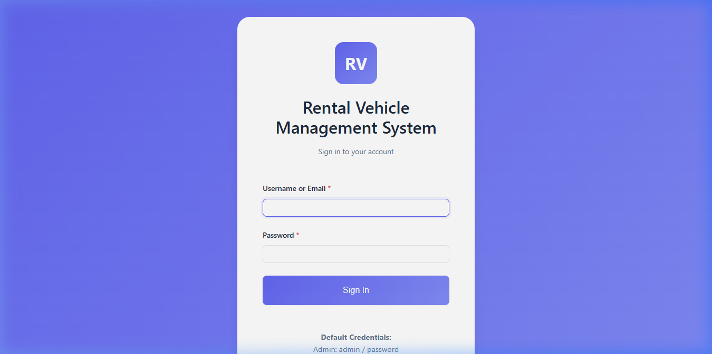

**Description:** The Login page is the primary public-facing entry point of the Rental Vehicle Management System. It displays the **RVMS** branding logo and the system title in a clean, centered card layout with a gradient blue-purple background. The form accepts a **Username or Email** address and **Password**, with real-time field validation. On successful credential verification against the `users` database table (bcrypt hash comparison via `password_verify()`), users are automatically redirected to their role-appropriate dashboard — Admin Panel, Staff Dashboard, or Customer Portal. The form includes visual error feedback for invalid credentials. Default credential hints (Admin: admin / password) are displayed below the form for development convenience. Session management and cookie setup are handled upon successful login.

---

#### A.2 Administrator Pages

**Login Credentials:** admin / password

---

**02. Admin Dashboard — `dashboard.php` (Admin Role)**

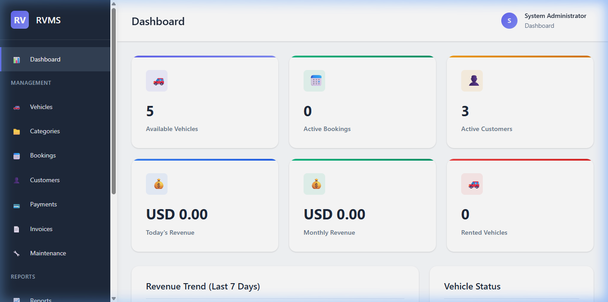

**Description:** The Admin Dashboard is the central command interface for the platform administrator. It is accessible after logging in with an admin account. The dashboard displays **six key performance indicator (KPI) stat-cards** in a responsive grid layout: **Available Vehicles**, **Active Bookings**, **Active Customers**, **Today's Revenue**, **Monthly Revenue**, and **Rented Vehicles**. Each stat-card is color-accented (blue, green, amber) and features a descriptive icon. Below the KPI cards, a **Revenue Trend (Last 7 Days)** section and a **Vehicle Status** breakdown panel provide real-time business intelligence. The left navigation sidebar shows the full Admin menu including Fleet, Bookings, Customers, Payments, Invoices, Maintenance, Reports, Users, Database Backup, and Settings.

---

**03. Fleet Inventory — `pages/vehicles.php`**

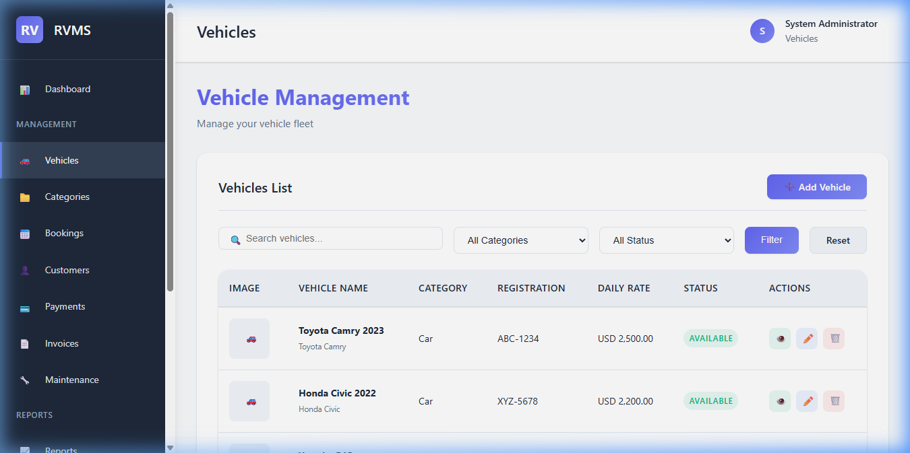

**Description:** The Fleet Inventory page provides the administrator and staff with a comprehensive, searchable listing of all vehicles in the rental fleet. The listing table displays each vehicle's **thumbnail image**, **Vehicle Name** (with brand and model sub-text), **Category**, **Registration Number**, **Daily Rate**, and a color-coded **Status badge** (Green = Available, Amber = Rented, Red = Maintenance). The toolbar includes a **search box**, **Category filter** dropdown, and **Status filter** dropdown. An **Add Vehicle** primary button opens the vehicle creation form, which collects: Category, Vehicle Name, Brand, Model, Year, Color, Registration Number, Chassis Number, Engine Number, Fuel Type, Seating Capacity, Daily/Weekly/Monthly Rates, Image Upload, Description, and Status. Action buttons per row allow View, Edit, and Delete operations.

---

**04. Vehicle Categories — `pages/categories.php`**

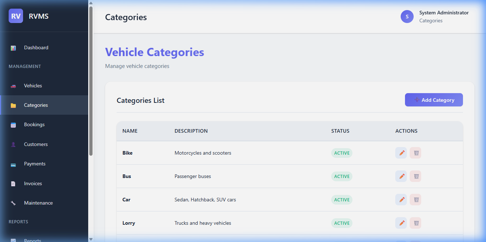

**Description:** The Vehicle Categories page allows administrators and staff to manage the fleet classification segments. Default categories include Car, Bike, Van, Lorry, and Bus. For each category, the table displays the **Category Name**, **Description**, **Icon identifier**, **Status badge**, and **Action buttons** for editing and deleting records. An **Add Category** form allows creating new segments with a name, description, icon, and status. Categories are linked to the `vehicles` table via a foreign key — deleting a category that has associated vehicles is blocked with a database constraint error, ensuring referential integrity.

---

**05. User Management — `pages/users.php`**

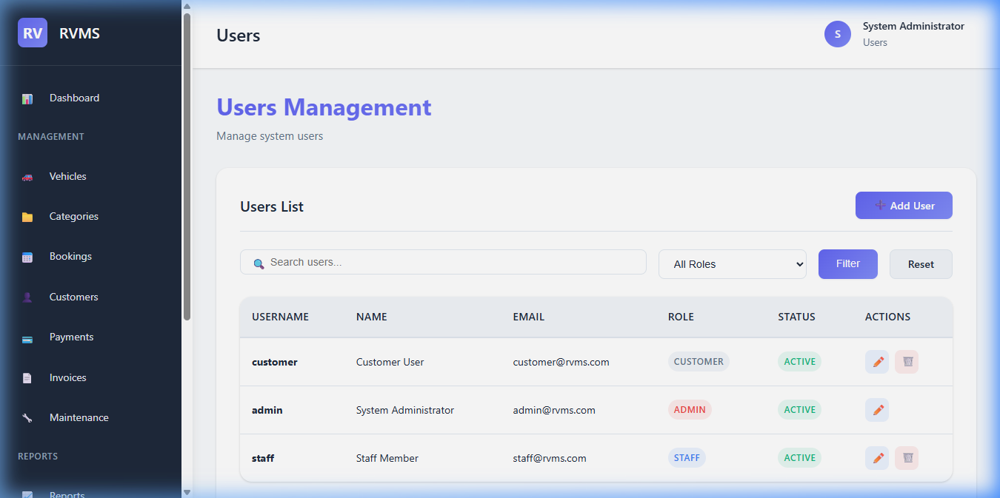

**Description:** The User Management page provides the administrator with a full directory of all registered platform users across all roles. The table displays each user's **Full Name**, **Username**, **Email**, **Role badge** (Admin, Staff, Customer), **Account Status** (Active, Inactive), and **Registration Date**. The administrator can create new system users directly without requiring the standard login flow. Search and filter capabilities allow quick lookup of specific users by name, email, or role. This page is exclusively accessible to the Admin role — staff and customer accounts are redirected if they attempt to access it.

---

**06. Financial Reports — `pages/reports.php`**


**Description:** The Reports page provides the administrator with a structured analytics dashboard summarizing platform performance metrics. Charts and summary tables present data on total revenue, number of bookings in various statuses, fleet utilization rates, active customer count, and booking trends. These analytics support data-driven decision-making for fleet procurement, pricing strategy, and operational scaling. The reports aggregate data from the `bookings`, `payments`, `vehicles`, and `customers` tables to produce a holistic view of the business's health and growth trajectory.

---

**07. System Settings — `pages/settings.php` (Admin)**

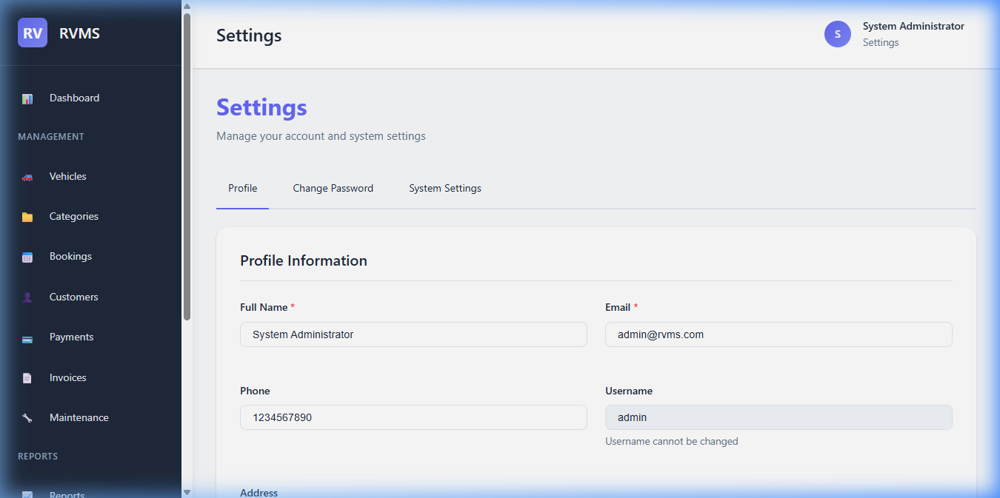

**Description:** The Settings page allows the administrator to configure platform-level operational parameters that affect system-wide behavior. Key configurable settings include **Company Name**, **Company Address**, **Contact Phone**, **Contact Email**, **Tax Rate Percentage**, **Currency Code** (INR, USD, EUR), **Invoice Number Prefix** (e.g., INV-), and **Booking Number Prefix** (e.g., BK-). All values are stored in the `settings` database table as key-value pairs and are retrieved dynamically at runtime. Changes take immediate effect across the entire application — for example, changing the currency code updates all price displays and invoice documents.

---

**08. Database Backup — `pages/backup.php`**

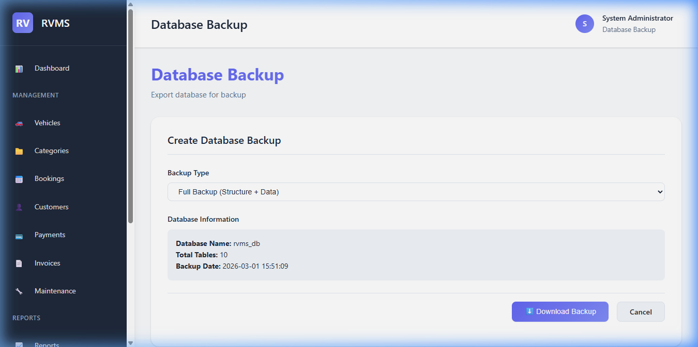

**Description:** The Database Backup page is an administrative utility for ensuring data redundancy and recovery capabilities. The page provides an on-demand SQL export tool that generates a complete dump of the `rvms_db` database — including all CREATE TABLE statements and INSERT data records. The exported `.sql` file can be downloaded directly to the administrator's local machine for offline storage. This page is exclusively accessible to the Admin role and serves as the primary disaster recovery tool for the platform without requiring direct server command-line access.

---

#### A.3 Staff Pages

**Login Credentials:** staff / password

---

**09. Staff Dashboard — `dashboard.php` (Staff Role)**

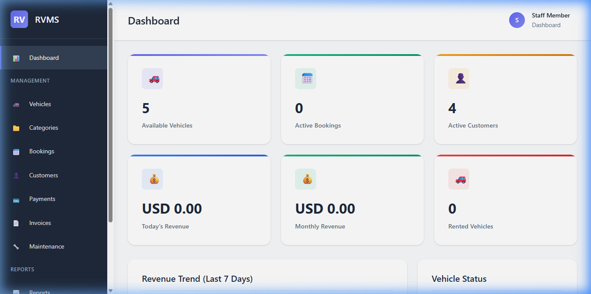

**Description:** The Staff Dashboard is the operational home screen for rental staff after login. It displays a focused set of KPI stat-cards relevant to the daily workflow: **Available Vehicles** count, **Active Bookings** requiring attention, **Active Customers**, and **Today's Revenue**. The left navigation sidebar for the Staff role includes Bookings, Customers, Payments, Invoices, Maintenance, and Reports — while administrative controls (Users, Backup, full Settings) are hidden. This role-scoped sidebar ensures staff members have quick access to their core operational tools without the complexity of full administrative controls.

---

**10. Booking Management — `pages/bookings.php`**

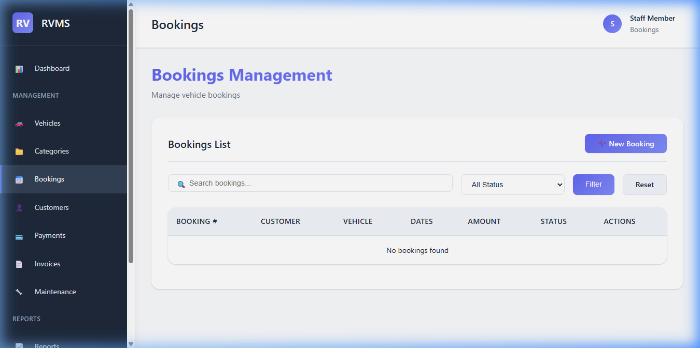

**Description:** The Booking Management page is the primary operational interface for staff processing rental requests. The page displays a searchable, filterable table of all bookings with columns for **Booking #** (unique reference), **Customer Name**, **Vehicle Name**, **Rental Dates** (Start → End), **Total Amount**, **Status badge** (Pending, Approved, Active, Completed, Cancelled), and **Action buttons**. Staff can create **New Bookings** using the top-right primary button, which opens a form for selecting customer, vehicle, dates, pickup/drop-off locations, and optional notes — with the system automatically calculating the total cost. Each booking row includes action buttons to View Details, Approve, Activate (mark as Active/In-Progress), Complete, Cancel, or Reject the reservation.

---

**11. Customer Management — `pages/customers.php`**

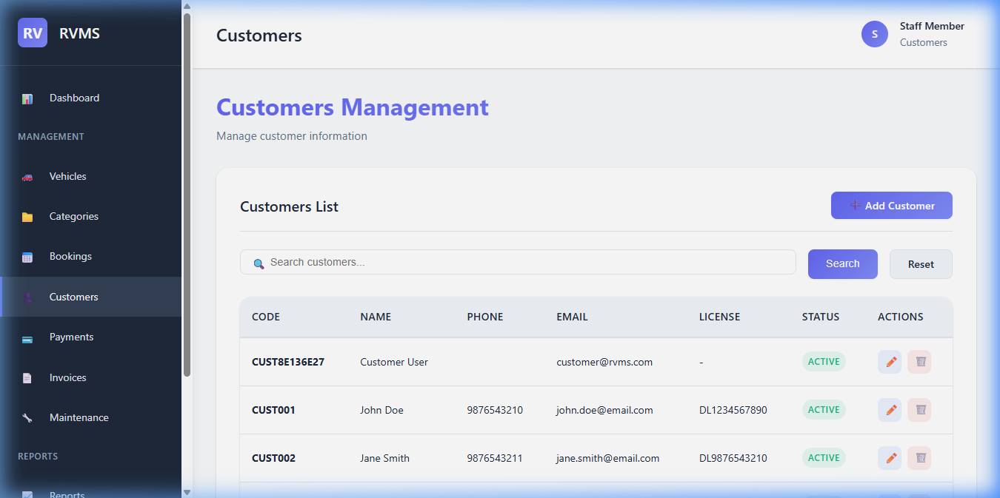

**Description:** The Customer CRM page provides staff with a comprehensive directory of all registered customer profiles. Each table row displays the **Customer Code** (auto-generated reference), **Full Name**, **Email**, **Phone Number**, **Driver's License Number**, **License Expiry Date**, **Account Status**, and **Action buttons**. Staff can add new customer profiles directly (supporting both walk-in customers without system accounts and linked user accounts). The search functionality enables rapid lookup by name, phone number, or email — critical for quick customer identification during vehicle check-in and check-out workflows. Customer documents (ID proof, address proof) can be uploaded and stored against each profile.

---

**12. Payment Recording — `pages/payments.php`**

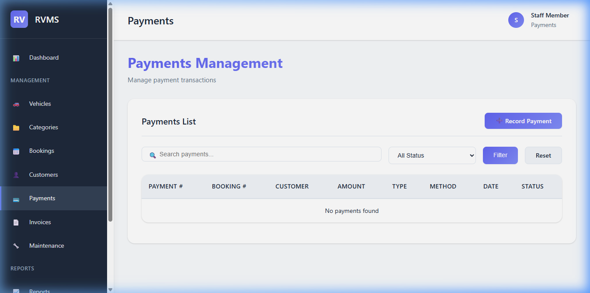

**Description:** The Payment Recording page displays all financial transactions associated with bookings across the platform. Each payment record shows the **Payment Number** (unique reference), **Booking #**, **Payment Type** (Advance, Full, Partial, Refund), **Amount**, **Payment Method** (Cash, Card, Bank Transfer, Online), **Payment Date**, and **Status badge** (Pending, Completed, Failed, Refunded). Staff can record new payments against any existing booking, selecting the appropriate type and method. This creates a complete and auditable payment trail for every rental transaction and feeds the financial aggregation data used in the admin's revenue reports.

---

#### A.4 Customer Pages

**Login Credentials:** customer / password

---

**13. Customer Dashboard — `dashboard.php` (Customer Role)**

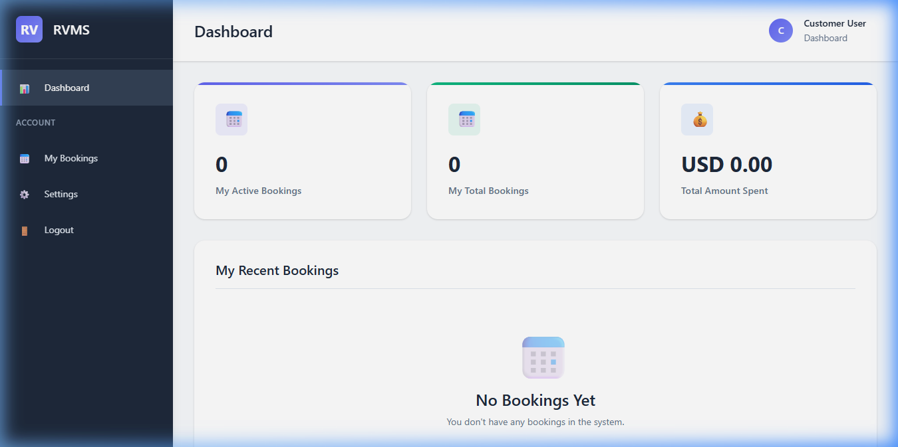

**Description:** The Customer Dashboard is the personalized home screen for registered customers after login. It displays a focused summary of the customer's rental activity through **three KPI stat-cards**: **My Active Bookings** (currently in progress rentals), **My Total Bookings** (cumulative booking count), and **Total Amount Spent** (cumulative spend). Below the stat-cards, a **"My Recent Bookings"** section shows the customer's latest rental transactions with status badges. The left navigation sidebar for the Customer role is scoped to only show: Dashboard, My Bookings, Settings, and Logout — providing a clean, uncluttered interface relevant to the customer's needs.

---

**14. My Bookings — `pages/my-bookings.php`**

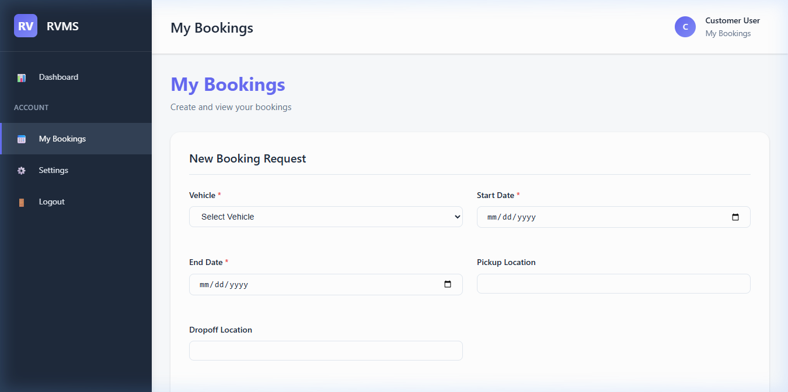

**Description:** The My Bookings page displays the complete personal rental history for the logged-in customer. Each booking entry shows the **Booking Number** (unique reference), **Vehicle Name** and model, **Rental Period** (start and end dates), **Total Duration** in days, **Total Amount** paid or due, and a color-coded **Status badge** (Pending: Grey, Approved: Blue, Active: Green, Completed: Dark, Cancelled: Red). Customers can view detailed booking information using the action button on each row. This page gives customers full transparency into their rental history, active reservations, and pending requests — serving as the primary self-service interface for booking-related inquiries.

---

**15. Customer Profile — `pages/settings.php` (Customer Role)**

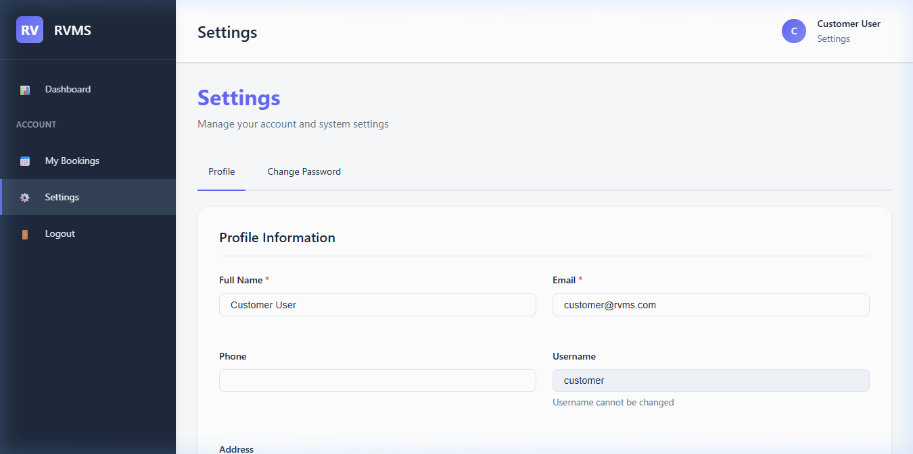

**Description:** The Customer Profile page provides authenticated customers with a self-service account management interface. Customers can update their personal information including **Full Name**, **Email Address**, **Phone Number**, and **Physical Address**. The profile form validates inputs before saving updated values to the `users` table. This page is role-neutral in its data fields — the same settings page serves both Staff and Customer users, showing system parameter controls only for Admin role accounts. It serves as the common account management panel, allowing customers to keep their contact information current for booking confirmations.

---

#### A.5 Session Management

**16. Secure Logout — `logout.php`**

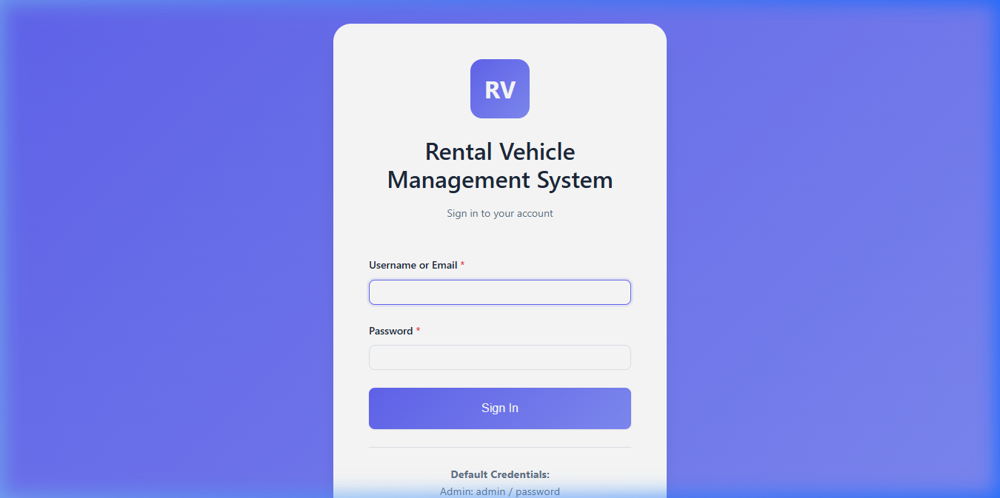

**Description:** The Logout page represents the secure session termination state of the Rental Vehicle Management System. When any authenticated user (Admin, Staff, or Customer) initiates logout by clicking the **Logout** link in the navigation sidebar, the `logoutUser()` function in `auth.php` is invoked. This function: (1) clears all `$_SESSION` variables, (2) expires and deletes the session cookie, and (3) calls `session_destroy()` to permanently invalidate the server-side session. After session destruction, the user is immediately redirected to `index.php` — the Login portal — confirming that all access has been revoked and no session data persists. This standardized logout sequence ensures complete privacy and security at the end of every user session.

---

*— End of Report —*
