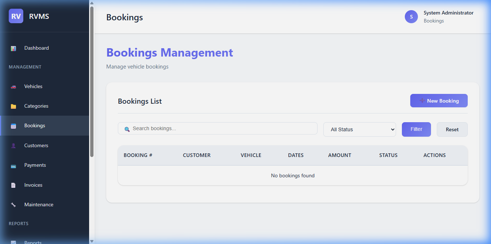
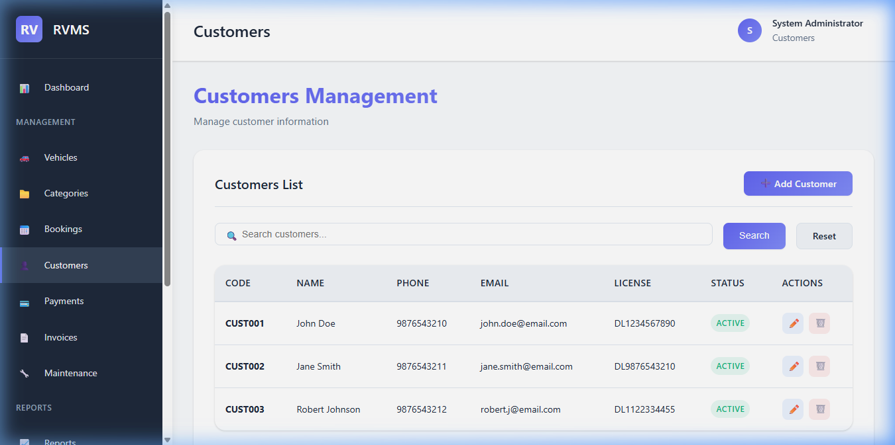
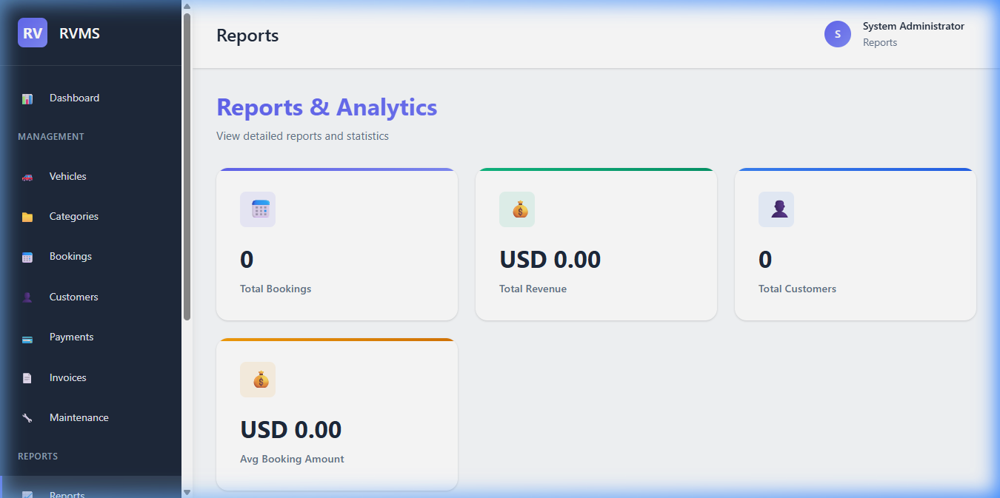
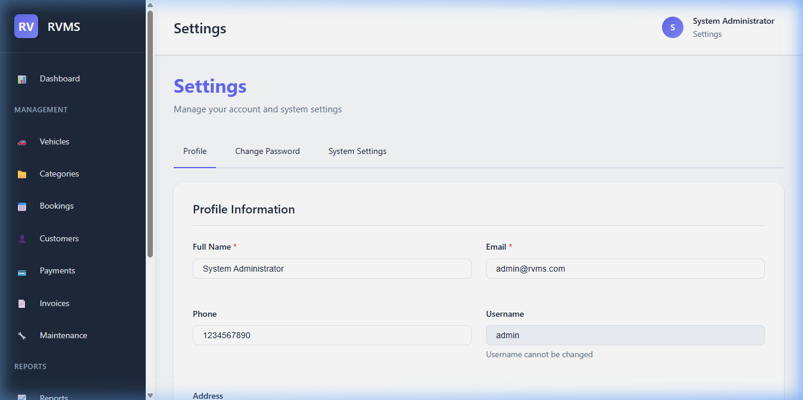

# PROJECT REPORT: RENTAL VEHICLE MANAGEMENT SYSTEM

## 1. PRELIMINARIES

### ACKNOWLEDGEMENT

The completion of this project was not just because of my ability but there are some well-wishers behind it. I am always thankful to them.

I would like to express my deep sense of gratitude and obligation to college council for providing necessary facility and given me the opportunity to do the entire college students in **Gobi Arts & Science College (Autonomous), Gobichettipalayam**.

I wish to record my deep sense of gratitude to our beloved Principal **Dr. P. VENUGOPAL, M.Sc., M.Phil., PGDCA., Ph.D.**, and Vice Principal **Dr. M. RAJU, M.A., M.Phill., Ph.D.**, and **Dr. N. SAKTHIVEL, M.com., M.B.A., M.Phill., PGDCA** for his inspiration which made me to complete this project.

I would like to acknowledge my gratitude to our beloved Head of the Department of Computer Science (Artificial Intelligence & Data Science) **Dr. M. Ramalingam, M.Sc.(CS)., M.C.A., Ph.D.**, for providing all facilities throughout the project.

I express my sincere thanks and gratitude to my project guide **Dr. M. Ramalingam, M.Sc.(CS)., M.C.A., Ph.D.**, Associate Professor, Department of Computer Science (Artificial Intelligence & Data Science), Gobi Arts & Science College (Autonomous), Gobichettipalayam, who has given me overwhelming support.

I am very much indebted to all faculty members of Information Technology and the programmers for their effort to complete this project successfully.

Finally, I thank my friends, brothers, sister and parents for their moral support to make this project a successful one.

**Kowsagan S (23AI139)**

---

### SYNOPSIS

The **Rental Vehicle Management System (RVMS)** is a comprehensive software solution designed to automate the manual processes of a vehicle rental business. In a manual system, tracking vehicle availability, calculating rental costs, and maintaining customer records is labor-intensive and error-prone. RVMS addresses these issues by providing a centralized database where all vehicle, customer, and booking information is stored securely. The system features multi-role access (Admin and Staff), automated billing, real-time availability checks, and detailed financial reports. Developed using pure PHP and MySQL, this system ensures a high level of operational efficiency and data integrity for rental agencies.

---

### TABLE OF CONTENTS

| CHAPTER | TITLE | PAGE NO. |
| :--- | :--- | :--- |
| **1.** | **INTRODUCTION** | **1** |
| 1.1 | ABOUT THE PROJECT | |
| 1.2 | HARDWARE SPECIFICATION | |
| 1.3 | SOFTWARE SPECIFICATION | |
| **2.** | **SYSTEM ANALYSIS** | **8** |
| 2.1 | PROBLEM DEFINITION | |
| 2.2 | SYSTEM STUDY | |
| 2.3 | PROPOSED SYSTEM | |
| **3.** | **SYSTEM DESIGN** | **10** |
| 3.1 | DATA FLOW DIAGRAM | |
| 3.2 | FILE SPECIFICATION (DATABASE TABLES) | |
| 3.3 | MODULE SPECIFICATION | |
| **4.** | **TESTING AND IMPLEMENTATION** | **15** |
| **5.** | **CONCLUSION AND SUGGESTIONS** | **17** |
| **6.** | **BIBLIOGRAPHY** | **19** |
| **APPENDICES** | | |
| A | SCREEN FORMATS | |

---

## CHAPTER 1: INTRODUCTION

### 1.1 ABOUT THE PROJECT
The Rental Vehicle Management System is a specialized application designed for vehicle rental companies to manage their fleet, bookings, and customer interactions efficiently. The project focuses on bridging the gap between manual record-keeping and modern digital management, offering a user-friendly interface for managing complex operations like rental timing, payment tracking, and vehicle maintenance logging.

### 1.2 HARDWARE SPECIFICATION
- **Processor:** Intel Core i3 / Core i5 / Core i7 or equivalent
- **RAM:** 4GB (minimum), 8GB (recommended)
- **Hard Disk:** 500GB or higher
- **Input Devices:** Keyboard and Mouse
- **Output Devices:** Monitor (Standard resolution)

### 1.3 SOFTWARE SPECIFICATION
- **Operating System:** Windows 10/11
- **Web Server:** XAMPP (Apache + MySQL)
- **Programming Language:** PHP 7.4 or higher
- **Frontend Technologies:** HTML5, CSS3, Vanilla JavaScript
- **Database:** MySQL 5.7+
- **Browser:** Google Chrome, Firefox, or Microsoft Edge

---

## CHAPTER 2: SYSTEM ANALYSIS

### 2.1 PROBLEM DEFINITION
Manual vehicle rental systems suffer from:
- **Inefficient Tracking:** Difficulty in knowing which vehicles are currently rented or available.
- **Reporting Errors:** Discrepancies in revenue calculation and booking history.
- **Data Redundancy:** Multiple entries for the same customer leading to database bloat.
- **Security Risks:** Physical registers are not password protected and can be easily lost.

### 2.2 SYSTEM STUDY
The current system in most small agencies relies on ledger books. When a customer arrives, the staff must manually check multiple pages to confirm vehicle availability. Financial summaries are only calculated at the end of the month, leading to a lack of real-time business insight.

### 2.3 PROPOSED SYSTEM
The proposed RVMS automates these tasks:
- **Real-time Availability:** Instant view of the fleet status.
- **Automated Billing:** Professional invoices are generated with a single click.
- **Role-Based Access:** Ensuring that only authorized staff can modify financial records.
- **Secure Storage:** All data is stored in a normalized MySQL database with regular backup capability.

---

## CHAPTER 3: SYSTEM DESIGN

### 3.1 DATA FLOW DIAGRAM (DFD)
- **Level 0 (Context Diagram):** The user enters credentials/data into the system, and the system provides reports and data confirmations.
- **Level 1 (Process Detail):**
  - **Process 1.0 (Login):** Validates user credentials.
  - **Process 2.0 (Manage Vehicles):** Add/Edit/Delete vehicle information.
  - **Process 3.0 (Booking):** Handles new reservations and availability checks.
  - **Process 4.0 (Payments):** Records financial transactions.

### 3.2 FILE SPECIFICATION (DATABASE TABLES)

#### 1. Table: `users`
| Field | Type | Description |
| :--- | :--- | :--- |
| `id` | INT | Primary Key, Auto-increment |
| `username` | VARCHAR(50)| Unique username for login |
| `role` | ENUM | 'admin', 'staff', 'customer' |
| `status` | ENUM | 'active', 'inactive' |

#### 2. Table: `vehicles`
| Field | Type | Description |
| :--- | :--- | :--- |
| `id` | INT | Primary Key, Auto-increment |
| `category_id` | INT | Foreign Key referencing categories |
| `vehicle_name`| VARCHAR(100)| Display name of the vehicle |
| `daily_rate` | DECIMAL | Rental cost per day |
| `status` | ENUM | 'available', 'rented', 'maintenance' |

#### 3. Table: `bookings`
| Field | Type | Description |
| :--- | :--- | :--- |
| `id` | INT | Primary Key, Auto-increment |
| `customer_id` | INT | Foreign Key referencing customers |
| `vehicle_id` | INT | Foreign Key referencing vehicles |
| `start_date` | DATE | Rental beginning date |
| `status` | ENUM | 'pending', 'approved', 'active', 'completed' |

---

### 3.3 MODULE SPECIFICATION

- **Admin Module:** Handles user creation, role assignment, and high-level system settings.
- **Fleet Management:** Allows staff to upload vehicle images, set prices, and track maintenance.
- **Booking Module:** A multi-step process that checks date conflicts before confirming a reservation.
- **Billing & Reports Module:** Generates daily and monthly revenue summaries with visual charts.

---

## CHAPTER 4: TESTING AND IMPLEMENTATION

The system was tested using both **Black Box** and **White Box** testing methodologies.
- **Unit Testing:** Verified that each individual form (Login, Add Customer, etc.) handles inputs correctly.
- **Integration Testing:** Confirmed that a completed booking correctly updates the vehicle status and payment record.
- **Acceptance Testing:** The system was verified against the initial business requirements for speed and accuracy.

---

## CHAPTER 5: CONCLUSION AND SUGGESTIONS

The Rental Vehicle Management System successfully fulfills the goal of digitizing vehicle rentals. It reduces paperwork by 90% and ensures that financial records are 100% accurate.
**Suggestions:** Future versions should include mobile app integration for customers and automated email notifications for booking confirmations.

---

## CHAPTER 6: BIBLIOGRAPHY

1. Ullman, Larry. "PHP and MySQL for Dynamic Web Sites."
2. Beighley, Lynn. "Head First PHP & MySQL."
3. Official PHP Documentation: [php.net](https://www.php.net)
4. W3Schools PHP & SQL Tutorials.

---

## APPENDICES

### APPENDIX A: SCREEN FORMATS

#### 1. Login Page

*Figure 1: The secure login interface where users enter their credentials to access the system.*

#### 2. Admin Dashboard

*Figure 2: The administrative overview showing key statistics, revenue charts, and recent activities.*

#### 3. Vehicle Management

*Figure 3: Interface for managing the vehicle fleet, including adding, editing, and tracking status.*

#### 4. Booking Management

*Figure 4: The central module for creating and approving vehicle reservations.*

#### 5. Customer Management

*Figure 5: Detailed view of the customer database with document verification status.*

#### 6. Reports & Analytics

*Figure 6: Visual reports showing revenue trends and business performance metrics.*

#### 7. System Settings

*Figure 7: Configuration panel for company information and system parameters.*

#### 8. Staff Dashboard

*Figure 8: The dashboard view for staff roles, focused on operations and daily tasks.*

---

## DECLARATION

I hereby declare that the project report entitled **“RENTAL VEHICLE MANAGEMENT SYSTEM”** submitted to the Principal, Gobi Arts & Science College (Autonomous), Gobichettipalayam, in partial fulfillment of the requirements for the award of degree of **Bachelor of Science (Computer Science, Artificial Intelligence & Data Science)** is a record of project work done by me during the period of study in this college under the supervision and guidance of **Dr. M. Ramalingam, M.Sc.(CS)., M.C.A., Ph.D.**, Associate Professor, Department of Artificial Intelligence & Data Science.

**Signature:**  
**Name:** Kowsagan S  
**Register Number:** 23-AI-139  
**Date:** March 2026

---

## CERTIFICATE

This is to certify that the project report entitled **“RENTAL VEHICLE MANAGEMENT SYSTEM”** is a bonafide work done by **Kowsagan S (23-AI-139)** under my supervision and guidance.

**Signature of Guide:**  
**Name:** M. RAMALINGAM  
**Designation:** Associate Professor  
**Department:** Computer Science (AI & DS)  
**Date:**

**Counter Signed:**

**Head of the Department** | **Principal**

**Viva-Voce held on:** ___________

**Internal Examiner** | **External Examiner**
